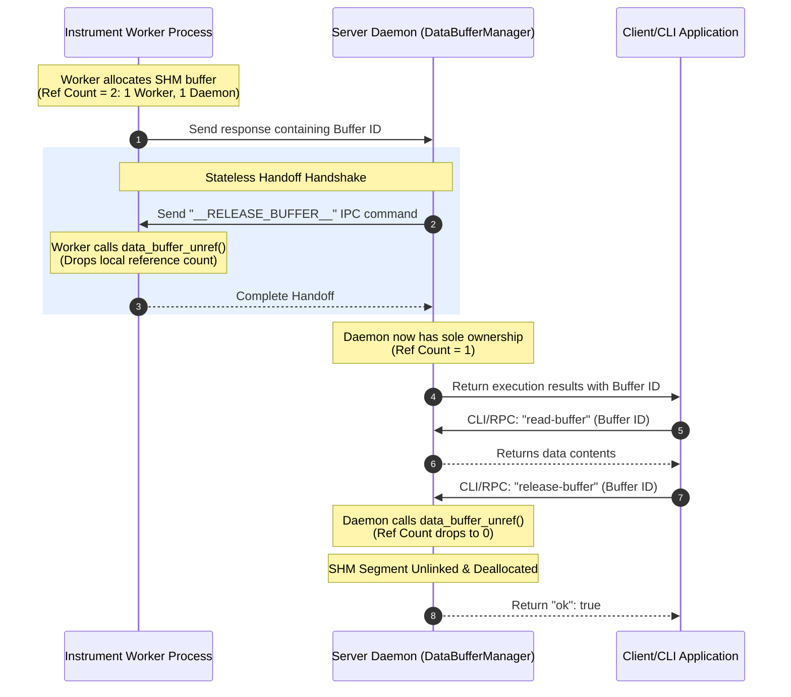

# IPC Protocol Specification

<!--toc:start-->
- [IPC Protocol Specification](#ipc-protocol-specification)
  - [Overview](#overview)
  - [Queue Architecture](#queue-architecture)
  - [Message Structure](#message-structure)
  - [Message Types](#message-types)
    - [COMMAND (Server → Worker)](#command-server-worker)
    - [RESPONSE (Worker → Server)](#response-worker-server)
  - [Protocol Flow](#protocol-flow)
    - [Normal Command Execution](#normal-command-execution)
    - [With Heartbeat](#with-heartbeat)
    - [Graceful Shutdown](#graceful-shutdown)
    - [Worker Death](#worker-death)
  - [Message Ordering](#message-ordering)
  - [Timeout Handling](#timeout-handling)
    - [Command Timeout](#command-timeout)
    - [Queue Timeout](#queue-timeout)
  - [Error Handling](#error-handling)
    - [Invalid Message](#invalid-message)
    - [Queue Full](#queue-full)
    - [Worker Crash](#worker-crash)
  - [Performance Characteristics](#performance-characteristics)
    - [Latency](#latency)
    - [Throughput](#throughput)
    - [Memory](#memory)
  - [Platform Differences](#platform-differences)
    - [Linux](#linux)
    - [Windows](#windows)
  - [Security Considerations](#security-considerations)
  - [Debugging](#debugging)
    - [Inspect Queues (Linux)](#inspect-queues-linux)
    - [Monitor Messages](#monitor-messages)
    - [Simulate Messages](#simulate-messages)
  - [Future Enhancements](#future-enhancements)
<!--toc:end-->

## Overview

Instrument workers communicate with the main server via Boost. Interprocess message queues using a bidirectional protocol.

## Queue Architecture

Each instrument has two queues:

- **Request Queue** (`instrument_<name>_req`): Server → Worker
- **Response Queue** (`instrument_<name>_resp`): Worker → Server

Queues are created in POSIX shared memory (`/dev/mqueue/` on Linux, named objects on Windows).

## Message Structure

```c
struct IPCMessage {
    Type type;              // Message type (4 bytes)
    uint64_t id;            // Message ID for matching (8 bytes)
    uint32_t payload_size;  // Size of payload (4 bytes)
    char payload[8192];     // JSON payload (8192 bytes)
};

enum class Type :  uint32_t {
    COMMAND = 1,
    RESPONSE = 2,
    SHUTDOWN = 3,
    HEARTBEAT = 4,
    ERROR = 5
};
```

Total message size: **8208 bytes** (fixed)

## Message Types

1. ### COMMAND (Server → Worker)

Instructs worker to execute a command.

**Payload**: JSON-serialized ==InstrumentCommand==

```JSON
{
  "id": "DMM1-1234567890",
  "instrument_name": "DMM1",
  "verb": "MEASURE_VOLTAGE",
  "timeout_ms": 5000,
  "priority": 0,
  "expects_response": true,
  "return_type": "float",
  "params": {
    "range": 10.0,
    "samples": 100
  }
}
```

**Fields**:

- ==id==: Unique command identifier
- ==instrument_name==: Target instrument
- ==verb==: Command name from API definition
- ==timeout_ms==: Execution timeout in milliseconds
- ==expects_response==: Whether command returns data
- ==params==: Key-value parameter map

1. ### RESPONSE (Worker → Server)

Returns result of command execution.

**Payload**: JSON-serialized ==InstrumentCommandResponse==

```JSON
{
  "command_id": "DMM1-1234567890",
  "instrument_name": "DMM1",
  "success": true,
  "error_code": 0,
  "error_message": "",
  "text_response": "3.14159",
  "return_value": 3.14159
}
```

Fields:

- ==command_id==: Matches original command ID
- ==success==: ==true== if command succeeded
- ==error_code==: Non-zero error code on failure
- ==error_message==: Human-readable error
- ==text_response==: Raw text response from instrument
- ==return_value==: Parsed return value (type depends on command)

1. HEARTBEAT (Worker → Server)

Worker alive signal, sent periodically (default: every 1 second).

**Payload**: Empty (size = 0)

Server tracks last heartbeat timestamp. Missing heartbeats trigger worker restart.

1. SHUTDOWN (Server → Worker)

Graceful shutdown request.

**Payload**: Empty (size = 0)

Worker should:

- Complete current command (if any)
- Call ==plugin_shutdown()==
- Clean up resources
- Exit process

1. ERROR (Worker → Server)

Fatal error notification (worker about to crash).

**Payload**: JSON with error details

```JSON
{
  "error_code": -1,
  "error_message": "Plugin crashed:  segmentation fault",
  "fatal":  true
}
```

## Protocol Flow

### Normal Command Execution

```Code

Server                           Worker
  │                                │
  ├─── COMMAND (id=42) ───────────>│
  │                                ├─ Execute plugin
  │                                ├─ Get result
  │<─── RESPONSE (id=42) ──────────┤
  │                                │
```

### With Heartbeat

```Code

Server                           Worker
  │                                │
  ├─── COMMAND (id=42) ───────────>│
  │<─── HEARTBEAT ─────────────────┤ (every 1s)
  │                                ├─ Long operation...
  │<─── HEARTBEAT ─────────────────┤
  │<─── RESPONSE (id=42) ──────────┤
  │                                │
```

### Graceful Shutdown

```Code

Server                           Worker
  │                                │
  ├─── SHUTDOWN ──────────────────>│
  │                                ├─ Finish current command
  │                                ├─ plugin_shutdown()
  │                                ├─ Exit(0)
  │                                X
  │
  └─ Wait for process exit
```

### Worker Death

```Code

Server                           Worker
  │                                │
  ├─── COMMAND (id=42) ───────────>│
  │<─── HEARTBEAT ─────────────────┤
  │                                ├─ CRASH!
  │                                X
  │
  ├─ Detect missing heartbeat
  ├─ Mark worker as dead
  └─ Fail pending commands
```

## Message Ordering

- FIFO: Messages are delivered in send order
- No reordering: Responses match request order
- Single-threaded worker: Commands execute serially

## Timeout Handling

### Command Timeout

If worker doesn't respond within ==timeout_ms==:

  1. Server-side future times out
  1. Promise is fulfilled with timeout error
  1. Worker continues execution (can't be canceled)
  1. Late response is discarded

### Queue Timeout

Send/receive operations have separate timeouts:

- Send timeout: 1 second (prevents blocking on full queue)
- Receive timeout: Varies by context (heartbeat: 1s, command: per-command timeout)

## Error Handling

### Invalid Message

Worker receives malformed JSON:

```C
// Worker logs error and sends ERROR message
IPCMessage error_msg;
error_msg.type = Type::ERROR;
snprintf(error_msg.payload, sizeof(error_msg.payload),
         "{\"error_message\": \"Invalid JSON in command\"}");
send(error_msg);
```

### Queue Full

Server can't send because queue is full (100 messages buffered):

- Server logs warning
- Returns timeout error to caller
- May indicate worker is stuck/slow

### Worker Crash

Worker process dies unexpectedly:

- Heartbeat monitoring detects death (within 10s)
- All pending commands fail with "Worker died" error
- Server can optionally restart worker (future enhancement)

## Performance Characteristics

### Latency

- Typical round-trip: < 1 ms (VISA command)
- IPC overhead: < 100 µs
- JSON serialization: ~ 50 µs per message

### Throughput

- Queue depth: 100 messages
- Message size: 8208 bytes
- Max throughput: ~10,000 commands/sec (if worker keeps up)

### Memory

- Per instrument: ~1.6 MB (2 queues × 100 msgs × 8208 bytes)
- Scalable: Shared memory, not copied per-process

## Platform Differences

### Linux

- Queues in /dev/mqueue/
- Cleanup: rm /dev/mqueue/instrument_*
- Max queue size: cat /proc/sys/fs/mqueue/msg_max

### Windows

- Named kernel objects
- Cleanup: Automatic on last process close
- No practical size limits

## Security Considerations

- No authentication: Any process can open queues (future: use permissions)
- No encryption: Data in plaintext in shared memory
- Sandboxing: Workers should run with limited privileges

## Debugging

### Inspect Queues (Linux)

```bash
# List queues
ls -l /dev/mqueue/

# Check queue attributes
cat /dev/mqueue/instrument_DMM1_req
```

### Monitor Messages

```bash
# Log all IPC traffic
export INSTRUMENT_IPC_DEBUG=1
instrument-script-server --config ...

```

### Simulate Messages

```bash
# Send test message (requires custom tool)
ipc-send --queue instrument_DMM1_req --type COMMAND --payload '{"id":"test",... }'
```

## Future Enhancements

- Zero-copy large data: Separate shared memory region for waveforms [COMPLETED - implemented as Stateless Buffer Handoff Protocol]
- Message compression: Compress JSON payloads > 1KB
- Priority queues: High-priority commands bypass queue
- Message batching: Send multiple commands in one IPC message
- Bidirectional streaming: For continuous acquisition

## Buffer Management RPC API

In addition to the C++ and CLI command wrappers, the underlying HTTP RPC server daemon (running on default port `8000`) exposes JSON-RPC endpoints for remote clients.

### 1. `list_buffers` (Client → Server)
*   **Command**: `list_buffers`
*   **Parameters**: `{}`
*   **Response**:
    ```json
    {
      "ok": true,
      "buffers": ["buffer_1779829276760326", "buffer_1779829276760734"]
    }
    ```

### 2. `get_buffer_metadata` (Client → Server)
*   **Command**: `get_buffer_metadata`
*   **Parameters**: `{ "buffer_id": "buffer_1779829276760326" }`
*   **Response**:
    ```json
    {
      "ok": true,
      "element_count": 10000,
      "data_type": "float32",
      "bytes": 40000
    }
    ```

### 3. `read_buffer` (Client → Server)
*   **Command**: `read_buffer`
*   **Parameters**: `{ "buffer_id": "buffer_1779829276760326" }`
*   **Response**:
    ```json
    {
      "ok": true,
      "element_count": 10000,
      "data_type": "float64",
      "data": [0.0, 0.0627, 0.1253, ...]
    }
    ```

### 4. `release_buffer` (Client → Server)
*   **Command**: `release_buffer`
*   **Parameters**: `{ "buffer_id": "buffer_1779829276760326" }`
*   **Response**:
    ```json
    {
      "ok": true
    }
    ```

## The Stateless Buffer Handoff Protocol

The buffer lifecycle spans multiple processes (Worker → Daemon → Client/CLI) to ensure that massive buffers are not copied unnecessarily. To guarantee that a buffer is not deallocated prematurely (while still enabling zero-leak cleanup), the following reference-counting ownership pipeline is enforced:



1. **Allocation**: When an instrument plugin requests a large data write, the Worker allocates a new buffer in shared memory. This registers it with `data_manager_allocate_buffer`. Both the Worker process and the Server Daemon process acquire process-local references (Ref Count = 2).
2. **Graceful Handoff**: Immediately after the daemon maps the returned buffer into its local process space, it issues a synchronous `__RELEASE_BUFFER__` IPC command back to the Worker. The Worker's proxy handler releases its process-local handle via `data_buffer_unref()`, transferring sole logical ownership to the server daemon (Ref Count = 1).
3. **Data Recovery**: The client fetches the results JSON. The client calls the CLI command `read-buffer` or RPC `read_buffer` to read the shared-memory array contents.
4. **Final Deallocation**: Once the client is finished with the data, it calls the CLI command `release-buffer` or RPC `release_buffer`. The server drops its local reference via `data_buffer_unref()`. Because this is the last remaining reference globally, the underlying shared-memory segment is cleanly destroyed.
